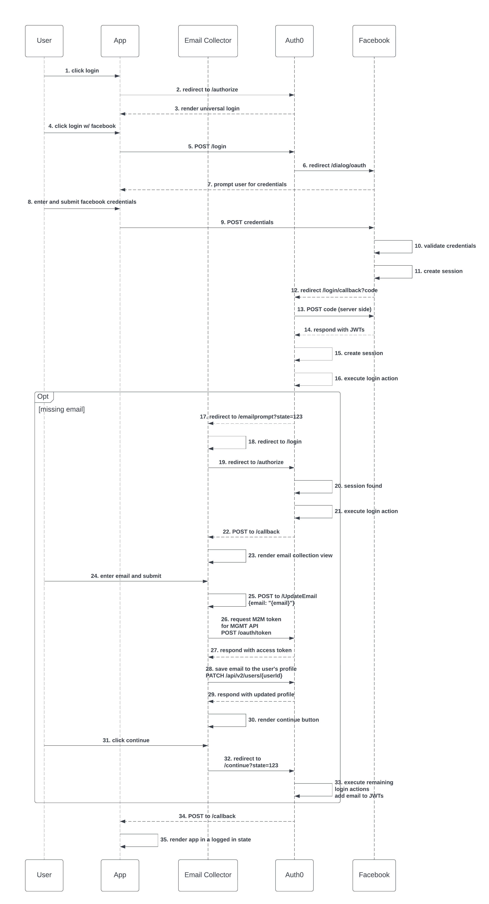
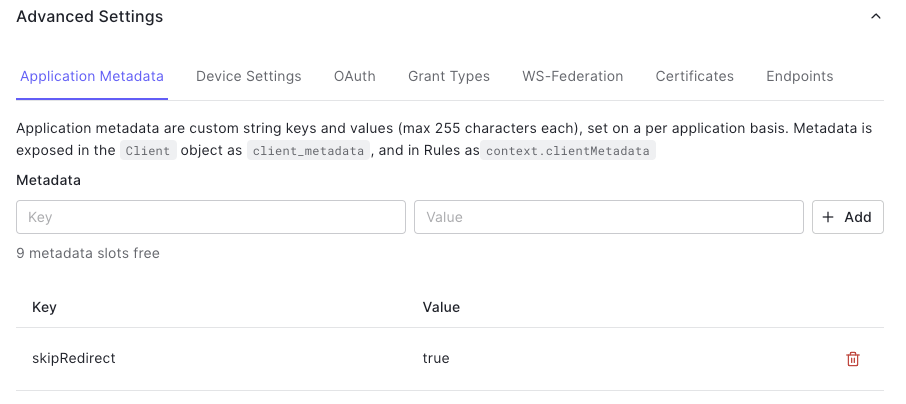
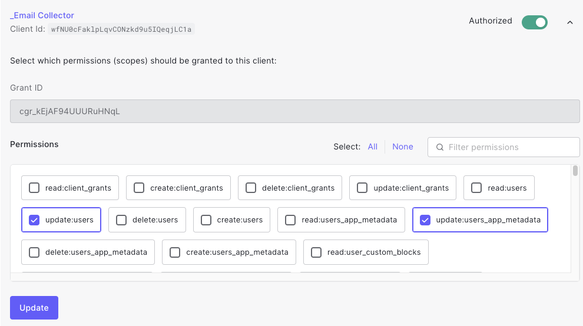

# Description  
This application is meant to be used with Auth0 [redirect login actions](https://auth0.com/docs/customize/actions/flows-and-triggers/login-flow/redirect-with-actions). It's purpose is to prompt the user for an email address when logging in with a social provider who does not require one (Facebook, Twitter, etc.). After collecting the user's email, a PATCH request is made to the Auth0 management API to set the user's email on the app_metadata.

**Note: This application is for POC purposes only and not meant for production. Additionally, there is no validation performed on the user's email other than out-of-box HTML email textfield validation.**  

## Framework
- dotnet 6.0  

## Flow  
The Auth0 redirect action should be configured to redirect to the [HomeController's](./Controllers/HomeController.cs) /emailprompt route to initiate the flow. Auth0 will include a **state** query parameter onto the redirect. The application saves this in a cookie as it's required when redirecting back to Auth0. 

The user is then redirected to the [AccountController's](./Controllers/AccountController.cs) /login route to trigger [silent authentication](https://auth0.com/docs/authenticate/login/configure-silent-authentication). This is to ensure the user has a valid session and a bad actor is not redirecting to the email collector application in an attempt to perform an account takeover attack. 

**Note: If the user does not have a valid session, they will be prompted for credentials**  

When silent authentication completes, the user will be prompted for an email. The email is then POSTed to the [HomeController's](./Controllers/HomeController.cs) /UpdateEmail route. Where it's saved to the user's Auth0 profile via a [PATCH request to /api/v2/users/{id}](https://auth0.com/docs/api/management/v2#!/Users/patch_users_by_id).  

The user will then be prompted with a continue button. When clicked, the [HomeController's](./Controllers/HomeController.cs) /Continue route executes sending the user back into the original authentication flow by redirecting to *https://{auth0 domain}/continue?state=123*

The redirect login action's **onContinuePostLogin** function executes but adding the email to the id and access token.




## Configuration  
###  Auth0 Tenant Configuration
1. Configure a Facebook social connection  

2. Create a new application of type webapp to represent the Email Collection applications    
    - Set the callback URL to http://localhost:3000/callback
    - Set the logout URL to http://localhost:3000
    - Enable the Facebook connection 
    - Scroll to the bottom of the screen and click on *Advanced Settings*. On the *Application Metadata* tab, add the key **skipRedirect** with a value of **true**  
    

3. Configure the email collection app to use M2M tokens. 
   - Navigate to the *Applications > APIs* screen and click on **Auth0 Management API**
   - Click on the *Machine to Machine Application* tab and scroll doen until you see the application created in the previous step
   - Click the slider to authorize the application to use the MGMT API
   - Select the required scopes and save
      - update:users
      - update:users_app_metadata
      
      
4. Create a [Login Action](https://auth0.com/docs/customize/actions/flows-and-triggers/login-flow) and copy the [sample script](./Auth0//EmailCollectionRedirectLoginAction.js)  


###  Application Configuration  
1. Add the following configuration in appsettings.json  


   ```
   "Auth0": {
    "Domain": "{auth0 or customer domain}",
    "ClientId": "{client id}",
    "MgmtClientId": "{same client id}",
    "MgmtClientSecret": "{client secret}",
    "Auth0Domain": "{auth0 domain}"
  }
  
 | Setting      | Description |
   | ----------- | ----------- |
   | Domain      | auth0 or customer domain       |
   | ClientId   | From the email collector application        |
   | MgmtClientId   | Same as above but used when requesting an M2M token        |
   | MgmtClientSecret   | Used when requesting an M2M token        |
   | Auth0Domain   | auth0 domain used to build the MGMT API audience         |

  2. Build the application *dotnet build*
  3. Run the application *dotnet run*  

## Testing  
1. Register another application that will be used to login  
2. Login to the application using a Facebook account with either no registered email or without requesting the email  
3. On the first login, the user should be sent to the email collector application  
4. On subsequent logins, after setting the alt email, the user should bypass the email collection application


